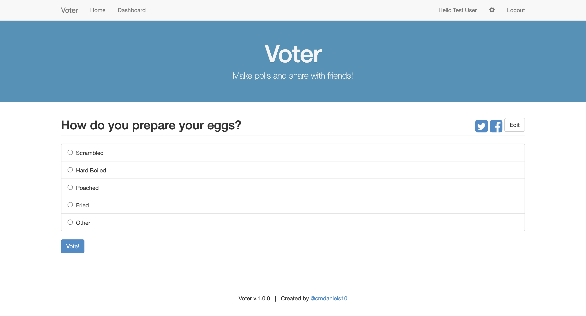
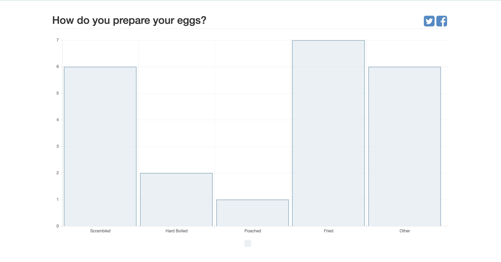

# voteroid

A NodeJS application for making polls and sharing with friends.

This project was generated with the [Angular Full-Stack Generator](https://github.com/DaftMonk/generator-angular-fullstack) version 3.1.1.

## Getting Started

### Prerequisites

- [Git](https://git-scm.com/)
- [Node.js and npm](nodejs.org) Node ^4.2.3, npm ^2.14.7
- [Bower](bower.io) (`npm install --global bower`)
- [Grunt](http://gruntjs.com/) (`npm install --global grunt-cli`)
- [MongoDB](https://www.mongodb.org/) - Keep a running daemon with `mongod`

### Developing

1. Run `npm install` to install server dependencies.

2. Run `bower install` to install front-end dependencies.

3. Run `mongod` in a separate shell to keep an instance of the MongoDB Daemon running

4. Run `npm start` to start the development server.

## Build & development

Run `grunt build` for building and `npm start` for preview.
